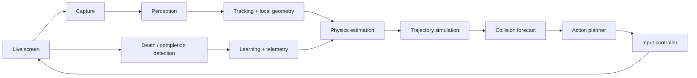

# Geometry Dash AI

Geometry Dash AI is an experimental, vision-based agent designed to learn to
play Geometry Dash from the same rendered pixels available to a human player.
It combines live screen capture, player and obstacle detection, online physics
estimation, trajectory prediction, collision forecasting, model-predictive
control, and feedback from failed attempts.

The V1 target is **Stereo Madness**, including its normal transitions between
**cube** and **ship** modes.

> [!IMPORTANT]
> This project does not read level files, inspect game memory, use mods to
> extract game state, replay prerecorded click macros, or use hardcoded Stereo
> Madness timestamps. Progress estimates are telemetry, never action triggers.

## Project Status

Early development. Phases 1 and 2 provide the repository foundation, typed
configuration, structured telemetry, deterministic synthetic simulator, swept
cube collision physics, and a survival-first cube trajectory planner. Live
perception and control are not yet ready for unattended gameplay.

## V1 Goals

- Observe live rendered gameplay through configurable screen capture.
- Track the player and recognize cube and ship modes.
- Infer local platforms, spikes, gaps, ceilings, corridors, and portals.
- Estimate physics from observed motion rather than assuming exact constants.
- Predict candidate trajectories and select actions by survival margin.
- Detect death and completion, restart safely, and learn from prediction errors.
- Complete Stereo Madness without a timestamp script or internal game access.

## How It Works



Cube planning compares no input with jumps at several future frame offsets.
Ship control continually evaluates short hold/release sequences. Both planners
will score collision risk, clearance, uncertainty, and safe landing or corridor
margins instead of relying on a fixed distance-to-spike rule.

## Architecture

The runtime is split into capture, vision, tracking, physics, planning, control,
learning, telemetry, UI, configuration, and simulation packages. Data crosses
those boundaries through small typed models so classical vision components can
later be replaced by learned ones. See [docs/architecture.md](docs/architecture.md).

## Repository Structure

```text
config/                     User-editable TOML configuration
src/geometry_dash_ai/
  capture/                  Live frame acquisition (planned)
  vision/                   Player and geometry perception (planned)
  tracking/                 Temporal state estimation (planned)
  physics/                  Calibrated dynamics and trajectories
  planning/                 Cube and ship action selection
  control/                  Input backends and safety controls
  learning/                 Failure-driven parameter adaptation
  telemetry/                Structured events and run statistics
  ui/                       Calibration/debug visualization
  config/                   Configuration loading and validation
  simulation/               Synthetic game environment
tests/                      Unit and synthetic integration tests
data/{runs,frames,models}/   Ignored runtime artifacts
data/calibration/           Local calibration outputs (ignored)
docs/                       Design and operating documentation
scripts/                    Repository-local helper scripts
```

## Requirements

- Python 3.11 or newer
- A desktop session capable of displaying Geometry Dash (for later live phases)
- Permission to capture the selected window region and synthesize input
- Optional native capabilities required by future capture/input backends

The synthetic simulator and unit tests do not require Geometry Dash, screen
capture permissions, or native desktop packages.

## Bazzite Development Environment

This project is developed on immutable Fedora-based Bazzite. Do not use `sudo`,
`dnf`, `rpm`, `rpm-ostree`, host package installation, privilege escalation, or
writes to protected system locations. Use a repository-local virtual environment
and `pip` inside it. If a native dependency is absent, report it as a blocker;
do not modify the host. See [docs/bazzite-setup.md](docs/bazzite-setup.md).

## Setup

```bash
python3 -m venv .venv
source .venv/bin/activate
python -m pip install --upgrade pip
python -m pip install -e '.[dev]'
cp config/default.toml config/local.toml
```

Edit `config/local.toml` for machine-specific capture coordinates and controls.
It is ignored by Git. The default configuration is safe: live input is disabled.

## Running the Synthetic Simulator

```bash
geometry-dash-sim --steps 240
# or without installing the entry point:
PYTHONPATH=src python -m geometry_dash_ai.simulation --steps 240
```

The demo runs known cube physics against a small synthetic layout and prints
periodic state snapshots plus the terminal outcome.

## Running Tests

```bash
python -m pytest
python -m ruff check .
python -m mypy src
```

CI runs only deterministic unit and synthetic tests. It never starts Geometry
Dash or performs live input automation.

## Live Game Calibration

Live calibration is planned for Phase 4. It will use a setup mode to select the
capture rectangle, verify player detection, and estimate cube and ship dynamics
from observed motion. Calibration records belong in `data/calibration/` and must
not be committed. See [docs/calibration.md](docs/calibration.md).

## Safety / Emergency Stop Controls

Live input is disabled until explicitly enabled in local configuration. The
planned controller has pause, resume, manual override, and a configurable
emergency-stop key (default: `F12`). Emergency stop must synchronously release
all held inputs. Test controls in a safe window before enabling automation.

## Data Collection

The runtime will combine sampled frames with an in-memory circular buffer and
preserve dense context only around events such as deaths and transitions.
Telemetry is written as compressed or line-delimited structured records. Raw
frames, recordings, runs, calibration output, and model artifacts are ignored by
Git. See [docs/data-format.md](docs/data-format.md).

## Limitations

- V1 is limited to Stereo Madness and cube/ship gameplay.
- The current phase is a synthetic foundation, not a complete live agent.
- Visual effects, themes, resolution scaling, latency, and compositor behavior
  can reduce perception and control accuracy.
- Automated input can affect the wrong application if focus or calibration is
  incorrect. Keep the emergency stop available.

## Roadmap

1. Repository foundation, configuration, telemetry, and synthetic simulator.
2. Cube collision physics, candidate trajectories, planner, and tests.
3. Screen capture, player/obstacle perception, and debug visualization.
4. Live cube calibration and control through the ship portal.
5. Ship physics and model-predictive control.
6. Death/completion detection, restart, failure logging, and adaptation.
7. Reliability, storage controls, statistics, and documentation polish.

## Contributing

Contributions are welcome. Read [CONTRIBUTING.md](CONTRIBUTING.md) and keep
changes focused, tested, and free of recordings, secrets, and gameplay macros.

## Security

Do not file vulnerabilities publicly. Follow [SECURITY.md](SECURITY.md),
especially for issues involving screen capture, input automation, model files,
arbitrary file access, or command execution.

## License

Released under the [MIT License](LICENSE).

## Disclaimer

This independent research project is not affiliated with, endorsed by, or
sponsored by RobTop Games. Geometry Dash names and assets belong to their
respective owners. Use automation responsibly and comply with applicable game,
platform, and community rules.
