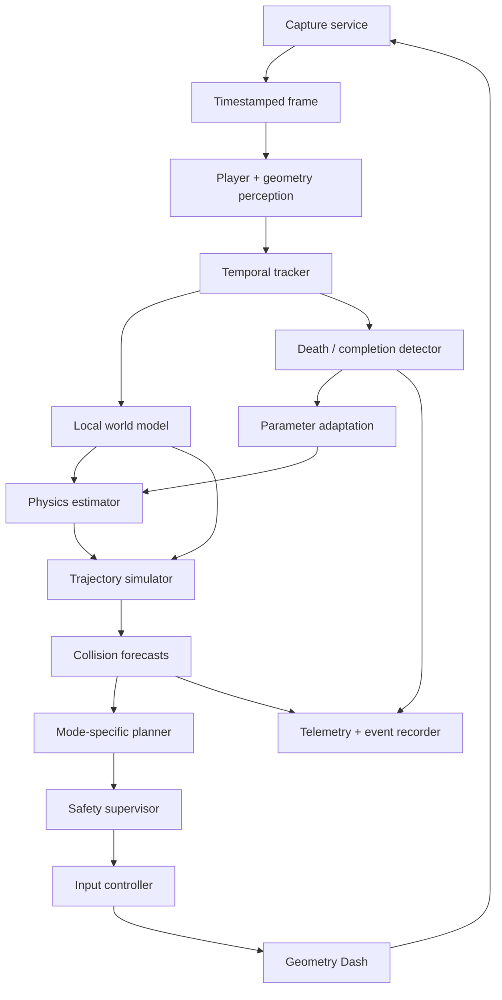

# Architecture

## Design Goals

Geometry Dash AI must make decisions from live rendered pixels and simulated
input, with no level-file parsing, memory inspection, extracted internal state,
or timestamp macros. Components are deliberately separated so observations,
uncertainty, predictions, actions, and outcomes remain inspectable.

## Runtime Data Flow

## Module Boundaries

- `capture`: owns region-bound frame acquisition, monotonic timestamps, measured
  FPS/latency, capture-region selection, and a latest-only bounded interface.
  The KDE backend uses only fixed user-session ScreenCast portal methods, then
  one ephemeral PipeWire FD with local GStreamer. It validates metadata, crop,
  and frame allocations and closes process/FD/session resources; mss remains an
  optional fallback and neither backend interprets pixels.
- `vision`: turns a validated frame into uncertain player and geometry detections
  using bounded classical vision, then converts screen geometry to player-relative
  Phase 2 primitives. It can display a read-only planner preview but has no
  authority to send input.
- `tracking`: associates observations over time and estimates position, velocity,
  mode, confidence, and stable local geometry.
- `physics`: owns validated geometry and separate cube/ship parameters. Cube
  dynamics use continuous solid/spike collision checks; ship dynamics use bounded
  held/released acceleration, velocity limits, and collision forecasts.
- `planning`: generates bounded mode-specific candidates and scores survival,
  clearance, landing quality, timing robustness, and uncertainty. Phase 2 supplies
  the cube planner and a bounded deterministic short-horizon ship MPC.
- `control`: exposes only the Geometry Dash action surface. The live backend uses
  fixed `RemoteDesktop` user-portal methods, requests keyboard only, and emits
  Space only. The guard owns permission/arming/running separation, rate limits,
  deadlines, watchdogs, session expiry, and release-on-failure.
- `learning`: collects visual manual cube arcs, robustly fits ballistic parameters,
  and stores bounded current/last-known-good models in validated JSON.
- `telemetry`: records versioned events and aggregate run statistics without
  participating in action selection. Explicit shadow logs are constrained below
  `data/runs`, reject symlinks, and contain no frame payload.
- `ui`: renders calibration and debug overlays from snapshots of other modules.
- `simulation`: supplies deterministic synthetic observations and known physics
  for development and CI; it is not a representation of Stereo Madness data.
- `config`: loads validated TOML and provides immutable settings.

## Shared Runtime Models

Future live components should communicate through immutable snapshots:

1. `CapturedFrame`: monotonic timestamp, frame number, pixel buffer, region.
2. `PlayerObservation`: bounding box, mode probabilities, confidence.
3. `GeometryObservation`: typed shapes and confidences in screen coordinates.
4. `TrackedWorld`: player kinematics plus player-relative collision geometry.
5. `TrajectoryCandidate`: action sequence, state samples, uncertainty envelope.
6. `CollisionForecast`: time, location, obstacle, probability, alternative.
7. `ActionDecision`: action, duration, rationale, confidence, decision timestamp.

Pixel buffers should be passed by reference/read-only view where practical. State
consumers must tolerate dropped frames and use monotonic time, not assume 60 FPS.

## Coordinates

Capture and vision naturally use image coordinates (origin at top-left, positive y
down). Physics uses Cartesian local coordinates (positive y up). A tested transform
at the tracking boundary converts between them. World geometry is maintained in
player-relative coordinates for planning, while screen/world mappings carry an
estimated scroll offset and uncertainty.

Phase 3 defines the precise transform in [perception.md](perception.md): the
tracked player lower-left is planner `(0, 0)`, x points right, y points up, and
one unit is one capture pixel until calibration changes the scale.

## Concurrency

Capture should own a bounded latest-frame slot instead of an unbounded queue.
Perception consumes the newest available frame, and control works from an atomic
world snapshot. Recording receives sampled/event frames through a bounded queue;
storage delays must never block emergency stop or input release.

## Safety Invariants

- Input starts disabled.
- Emergency stop immediately releases every held control before other cleanup.
- Stale frames or low-confidence state result in a safe release/pause policy.
- Planner actions expire; a controller never holds indefinitely without renewal.
- Telemetry, progress estimates, and attempt counts never directly trigger input.
- Untrusted calibration/model data is validated before use.
- Planner inputs reject NaN/infinity, malformed geometry, invalid dimensions, and
  excessive magnitudes before simulation.
- A plan processes at most 256 local geometry items, 64 nominal candidates, seven
  timing variants per candidate, 1,200 fixed steps per trajectory, and a five
  second horizon. Defaults are substantially smaller.
- Candidate simulation does not mutate caller-owned state or geometry.
- The standalone observation runtime imports neither `control` nor an input backend;
  it can only capture, process, shadow-plan, visualize, and retain bounded
  diagnostics. Planner recommendations have no execution path.

## Alpha supervisor lifecycle

The `app` package owns explicit states from setup through capture, Observe,
Shadow, permission, arming, Running, pause/death/retry/completion, degradation,
and shutdown. Tk only displays snapshots and invokes state transitions; capture,
perception, calibration, planning, and control work run off its event loop. A
bounded `deque(maxlen=1)` gives latest-frame semantics. All Running paths pass
through the readiness gate and `GuardedActionController`; exceptions release the
action before state degradation. A local `flock` prevents two live controllers.

## Phase 2 Planning Boundary

The cube planner accepts a `CubeState`, `LocalGeometry`, calibrated
`CubePhysicsParameters`, and `CubePlannerConfig`. Its `PlanDecision` is directly
consumable by future control/debug layers and includes every candidate trajectory,
individual score components, confidence, and explicit unavoidable-death metadata.
The synthetic planner has no imports from capture, desktop input, telemetry, or
wall-clock services.

## Delivery Phases

The implementation follows the seven phases in the README. Each phase keeps CI
headless and deterministic, while live-game checks remain explicit manual tests.
